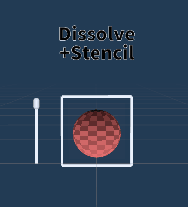

<!--
==================================================
# TODO list
- [ ] ギミック
  - [x] 絵画ギミック (最優先！)
  - [x] Dissolve 基礎
  - [x] Stencil 基礎
  - [ ] 着替えギミック
  - [x] 4次元ポケット (Rejected)
  - [x] 目に髪がかかっても目が浮いて見える (Rejected)
  - [ ] 箱の中だけ別世界
  - [ ] 
- [ ] GIF
  - [x] Dissolve 基礎
  - [x] Stencil 基礎
  - [ ] 絵画ギミック
  - [ ] 着替えギミック
  - [x] 4次元ポケット (Rejected)
  - [x] 目に髪がかかっても目が浮いて見える (Rejected)
  - [ ] 箱の中だけ別世界
  - [ ] 絵画ギミックの作り方 (Unity)
==================================================
-->

<!-- _class: titlecall -->
# 出入りできる絵画ギミックを作ろう (Dissolve / Stencil)

---

<!-- _class: bg -->

## 講師紹介
名前: ねこぼっくす
好きなもの: 紅茶と焼き菓子
最近ハマってること: Resonite

---

<!-- _class: changed -->

## 講義にあたってのお願い

- **必須**
  - 講師をShow Avatar (シフォンちゃんが見えたらOK！)
  - イヤーマフの解除 (テキストボックスの視認性向上のため)
- **できたらより便利**
  - 講義資料を手元で開く (Discordのクラスチャンネルに資料有り)

講義進行のためご協力をお願いします！
(できた人は手を挙げるボタンで教えてください)

---

## この講義を受けるとうれしいこと

1. 衣装や小物の**出現**や**消失**を**リッチにする**方法が分かる
1. **見せたい所**と**見せたくない所**を**制御する術**を知れる
1. **遊び心**や**インパクト**がある**表現の仕組み**を学べる

---

## 本日の流れ

1. Dissolve ってなに？
2. Dissolveでの消失エフェクトについて
3. Stencil ってなに？
4. Stencilでのマスク表現について
5. 組み合わせるとどうなる？
6. 絵画ギミックを実際に作ってみよう

---

<!-- _class: titlecall -->
<!-- header: '**1. Dissolve ってなに？**' -->

# 1. Dissolve ってなに？
2. Dissolveでの消失エフェクトについて
3. Stencil ってなに？
4. Stencilでのマスク表現について
5. 組み合わせるとどうなる？
6. 絵画ギミックを実際に作ってみよう

---

<!-- _class: bg -->

## Dissolve ってこんな感じ

---

## Dissolve(溶解) とは
- **条件を満たした部分を(溶かしたように)見えなくするモノ**
- 小物や衣装の「フェードイン/フェードアウト」によく使われる

---

<!-- _class: titlecall -->
<!-- header: '**2. Dissolveでの消失エフェクトについて**' -->

1. Dissolve ってなに？
# 2. Dissolveでの消失エフェクトについて
3. Stencil ってなに？
4. Stencilでのマスク表現について
5. 組み合わせるとどうなる？
6. 絵画ギミックを実際に作ってみよう

---

## Dissolveのエフェクトの種類
- **座標:** ルートボーンや原点からの距離もしくは方向で溶ける部分を指定
- **透明度:** テクスチャの透明度で溶ける部分を指定
- **UV:** テクスチャの中心からの距離もしくは方向で溶ける部分を指定

---

<!-- _class: bg -->

### Dissolve(透明度)の動作
テクスチャの透明度で溶ける部分を指定

---

<!-- _class: bg -->

### Dissolve(UV:点)の動作
テクスチャの中心からの距離もしくは方向で溶ける部分を指定

---

<!-- _class: bg -->

### Dissolve(UV:線)の動作
テクスチャの中心からの距離もしくは方向で溶ける部分を指定

---

<!-- _class: bg -->

### Dissolve(座標:点)の動作
ルートボーンや原点からの距離もしくは方向で溶ける部分を指定

---

<!-- _class: bg -->

### Dissolve(座標:線)の動作
ルートボーンや原点からの距離もしくは方向で溶ける部分を指定

---

<!-- _class: bg -->

### Dissolve(座標:線の上下)のマテリアルを2つ同時に入れた時の動作
何かが消えると同時に何かが現れるような表現ができる

---

<!-- _class: titlecall -->
<!-- header: '**3. Stencil ってなに？**' -->

1. Dissolve ってなに？
2. Dissolveでの消失エフェクトについて
# 3. Stencil ってなに？
4. Stencilでのマスク表現について
5. 組み合わせるとどうなる？
6. 絵画ギミックを実際に作ってみよう

---

<!-- _class: bg -->

## Stencilってこんな感じ

---

## Stencil(型紙) とは
- **条件を満たした部分を(型紙のように)切り抜くモノ**
- いわゆる「マスク」を動的に行える

---

<!-- _class: titlecall -->
<!-- header: '**4. Stencilでのマスク表現について**' -->

1. Dissolve ってなに？
2. Dissolveでの消失エフェクトについて
3. Stencil ってなに？
# 4. Stencilでのマスク表現について
5. 組み合わせるとどうなる？
6. 絵画ギミックを実際に作ってみよう

---

## liltoonにおけるStencilのプリセット
- **Writer:** オブジェクトにRefの値を設定する
- **Reader:** Writer越しに見たときにRefの値が同じなら非表示 (NotEqual)
- **Reader(反転):** Writer越しに見たときにRefの値が同じなら表示 (Equal)

---

## Stencilの主な条件式
- **Always:** Refの値を参照せず常に表示、liltoonのデフォルトはこれ
- **Equal:** 指定したRefと等しいオブジェクト越しに見たときだけ表示
- **NotEqual:** 指定したRefと等しいオブジェクト越しに見た時だけ非表示

---

<!-- _class: bg -->

### Readerの動作

Writer越しに見たときにRefの値が同じなら非表示 (NotEqual)

---

<!-- _class: bg -->

### Reader(反転)の動作

Writer越しに見たときにRefの値が同じなら表示 (Equal)

---

<!-- _class: bg -->

### ReaderとReader(反転)のマテリアルを2つ同時に入れた時の動作

共存して両方が個別の条件で表示される

---

<!-- _class: titlecall -->
<!-- header: '**5. 組み合わせるとどうなる？**' -->

1. Dissolve ってなに？
2. Dissolveでの消失エフェクトについて
3. Stencil ってなに？
4. Stencilでのマスク表現について
# 5. 組み合わせるとどうなる？
6. 絵画ギミックを実際に作ってみよう

---

<!-- _class: bg -->

## Dissolve と Stencil を 組み合わせたら

額縁をルートボーンとStencil(Writer)に設定すると...
**額縁の外と内で別々のモノが見える**ようになる！

---

<!-- _class: titlecall -->
<!-- header: '**6. 絵画ギミックを実際に作ってみよう**' -->

1. Dissolve ってなに？
2. Dissolveでの消失エフェクトについて
3. Stencil ってなに？
4. Stencilでのマスク表現について
5. 組み合わせるとどうなる？
# 6. 絵画ギミックを実際に作ってみよう

---

<!-- _class: changed -->

## 絵画ギミックの作り方
1. シンプルな額縁を作成
2. アバターの全メッシュのルートボーンを額縁に設定
3. 額縁の前面の板をStencil(Writer)にして値を決める
4. アバターの全マテリアルを額縁の外側と内側用に2つコピー
5. 額縁の外側用の全マテリアルにStencil(Reader)とDissolve(座標:線+Z)を設定
6. 額縁の内側用の全マテリアルにStencil(Reader:反転)にDissolve(座標:線-Z)を設定
7. 額縁のON/OFFとワールド固定のメニューを作る
8. 動作確認(Gesture Manager)
### →長い！難しい！授業内で終わらない；；

---

## 絵画ギミックに挑戦したい人は

**ごめんなさい！** 授業内では時間が足りないので扱いません...
挑戦してみたい方は**授業後に公開される資料を参照**しながら作ってみてください！

---

<!-- _class: bg changed -->

### 1-1. 額縁の親GameObjectを生成
- **空のGameObjectの生成方法:**  Hierarchyウィンドウを右クリックして`Create Empty`
- **名前をつける:**  判別しやすいように「額縁」や「Frame」などの名前をつける

---

<!-- _class: bg changed -->

### 1-2. 額縁のTransformを調整
- **位置を調整:**  額縁の`Transform > Position`の`X`を0、`Y`を0.75、`Z`を1にする
- **回転を調整:**  額縁の`Transform > Rotation`の`X`を0、`Y`を180、`Z`を0にする
- **大きさを調整:**  額縁の`Transform > Scale`の`X`を1、`Y`を1、`Z`を1.5にする

---

<!-- _class: bg changed -->

### 1-3. 額縁の前面・背面を作成
- **Quadの生成方法:**  額縁の中でHierarchyを右クリックして`3D Object > Quad`
- **前面を作成:**  前面用のQuadを生成後に`Transform > Rotation > Y`を180にして正面(+Z)に向ける
- **背面を作成:**  背面用のQuadを生成後に`Transform > Rotation > Y`を-180にして背面(-Z)に向ける

---

<!-- _class: bg changed -->

### 1-4. 額縁の上下のフレームを作成
- **Cubeの生成方法:**  額縁の中でHierarchyを右クリックして`3D Object > Cube`
- **上下の大きさを設定:**  上下用のCubeを生成後に`Transform > Scale`の`X`を1、`Y`と`Z`を0.01にする
- **上下の位置を設定**  `Transform > Position`の`X`を0、`Y`を0.5と-0.5、`Z`を0にする

---

<!-- _class: bg changed -->

### 1-5. 額縁の側面のフレームを作成
- **Cubeの生成方法:**  額縁の中でHierarchyを右クリックして`3D Object > Cube`
- **側面の大きさを設定:**  側面用のCubeを生成後に`Transform > Scale`の`X`を1、`Y`と`Z`を0.01にする
- **側面の位置を設定**  `Transform > Position`の`X`を0.5と-0.5、`Y`を0、`Z`を0にする

---

<!-- _class: bg changed -->

### 1-6. 額縁の前面・背面のマテリアルを作成
- **マテリアルの生成方法:**  Projectウィンドウを右クリックして`Create > Material`
- **liltoonに変換:**  Inspectorウィンドウ上部の`Standard`を選択してリストの下部にある`liltoon`を選択

---

<!-- _class: bg changed -->

### 1-7. 額縁の前面・背面にマテリアルを適用
- **前面のマテリアルを設定:**  作成したマテリアルを前面Quadにドラッグ&ドロップして適用する
- **背面のマテリアルを設定:**  作成したマテリアルを背面Quadにドラッグ&ドロップして適用する

---

<!-- _class: bg changed -->

### 1-8. 額縁の前面・背面を半透明にする
- **半透明:**  `描画モード`を半透明、基本設定の`ZWrite`のチェックを外す
- **Unlit化:**  `ライティング/明るさ設定`の`Unlit化`を1にする
- **透明度:**  `メインカラー/透過設定`の色の`A`を1にする

---

<!-- _class: bg changed -->

### 2-1. アバターの全メッシュのルートボーン設定
- **ルートボーンの作成:**  空のGameObjectを作成してルートボーンと分かる名前にする
- **メッシュの設定:** `MA Mesh Settings`をアバターにつけてルートボーンに上記で作成したGameObjectを設定する

---

<!-- _class: bg changed -->

### 2-2. ルートボーンを額縁に追従させる
- **追従用のGameObjectを作成:**  空のGameObjectを作成して追従用と分かる名前にする
- **追従設定:**  `VRC Parent Constraint`をつけて`Sources`に額縁、`Advanced Settings > Target Transform`にルートボーンを設定

---

<!-- _class: bg changed -->

### 3. 額縁の前面の板をStencil(Writer)にして値を決める
- **Writer設定:** 額縁の前面のマテリアルを生成して`基本設定`最下部の`通常`から`Writer`に変更する
- **値の設定:** 詳細設定の`ステンシル`にある`Ref`を0～255の間で他のギミックと干渉しなさそうなランダムな値にする

---

<!-- _class: bg changed -->

### 4. アバターの全マテリアルを額縁の外側・内側用に2つコピー
- **名前の変更:**  `<元の名前>_<Outside/Inside>`など名前をつけて判別しやすくする
- **描画モード変更:**  `不透明`はカットアウト、`半透明`は半透明のままにする

---

<!-- _class: bg changed -->

### 5-1. 額縁の外側用の空のマテリアルを作成
- **空のマテリアルを作成:**  マテリアルを生成してliltoonに変換
- **名前の変更:**  「絵画ギミック_外側」など判別しやすい名前をつける

---

<!-- _class: bg changed -->

### 5-2. 額縁の外側用の空マテリアルにStencil(Reader)を設定
- **Reader:**  基本設定の最下部にある`通常`を`Reader`に変更
- **Ref:**  詳細設定の`ステンシル`にある`Ref`を額縁とは違う値にする

---

<!-- _class: bg changed -->

### 5-3. 額縁の外側用の空マテリアルにDissolve(座標:線)を設定
- **Dissolve:**  詳細設定の`Dissolve`にある`座標`を`線`に変更する
- **方向指定:**  `Dissolve`内の方向を`X`,`Y`を0、`Z`を1にする 
- **パラメーター:**  `Dissolve`内の`範囲`・`ぼかし`・`ノイズ`を0にする

---

<!-- _class: bg changed -->

### 5-4. 額縁の外側用のマテリアルプリセット保存画面を開く
- **プリセット画面を開く:**  マテリアル設定の上部にある`プリセット`を開く
- **プリセット保存画面を開く:**  `プリセット`右下にある`プリセットを保存`を開く

---

<!-- _class: bg changed -->

### 5-5. 額縁の外側用のマテリアルプリセットを作成
1. `名前`に「絵画ギミック_外側」など判別しやすい名前をつける
2. `カテゴリ`をその他にする
3. `Deselect All`ボタンなど活用しながら全てのチェックを外す
4. `Dissolve`、`輪郭線`、`ステンシル`にチェックを入れる
5. 最下部の`Save`を押してマテリアルプリセットを保存

---

<!-- _class: bg changed -->

### 5-6. 額縁の外側用の全マテリアルにマテリアルプリセットを適用
- **適用したいマテリアルを選択:**  額縁の外側用マテリアルを選択
- **プリセット画面を開く:**  マテリアル設定の上部にある`プリセット`を開く
- **プリセットを適用:**  `プリセット`下部にある`その他`から作成したプリセットを適用

---

<!-- _class: bg changed -->

### 6-1. 額縁の外側用の空マテリアルをコピーして内側とする
- **コピーを作成:**  外側用のマテリアルをProjectウィンドウで選択してコピペ、もしくはCtrl+Dで複製
- **名前の変更:**  「絵画ギミック_内側」など判別しやすい名前をつける

---

<!-- _class: bg changed -->

### 6-2. 内側用の空マテリアルの設定
- **Reader(反転):**  基本設定の最下部にある`通常`を`Reader(反転)`に変更
- **Ref:**  詳細設定の`ステンシル`にある`Ref`を額縁と同じ値にする
- **Dissolveの方向を反転:**  詳細設定の`Dissolve`の方向を`Z`を-1にする

---

<!-- _class: bg changed -->

## 6-3.外側と同じようにマテリアルプリセットに登録・適用を行う
### ※手抜きではありません！！！(?)

---

<!-- _class: bg changed -->

### 7-1.額縁のON/OFFのメニューを作る
- **メニューの作成方法:**  空のGameObjectを生成して`MA Menu Item`と`MA Menu Installer`をつける
- **ON/OFFの設定方法:**  `MA Object Toggle`をつけて額縁をトグルの指定先にする

---

<!-- _class: bg changed -->

### 7-2.額縁のワールド固定
- **額縁をワールド固定:**  額縁に`MA World Fixed`をつける
- **額縁を追従プレイヤーに追従:**  空のGameObjectを作成して`VRC Parent Constraint`をつけて`Sources`にアバタールート、`Advanced Settings > Target Transform`に額縁を指定する

---

<!-- _class: bg changed -->

### 7-3. ワールド固定のメニューを作る
- **メニューの作成方法:**  空のGameObjectを生成して`MA Menu Item`と`MA Menu Installer`をつける
- **ON/OFFの設定方法:**  `MA Object Toggle`をつけてワールド固定のGameObjectをトグルの指定先にする

---

<!-- _class: bg -->

### 8. 動作確認(GestureManager)
アバターや額縁を動かしたり、メニューからON/OFFやワールド固定を試してみよう

**全部が正常に動いたら...**

---

<!-- _class: titlecall -->
## 絵画ギミック完成！おめでとう！！！

---

<!-- header: '' -->

## 振り返り
- **Dissolve** は「条件を満たした部分を(溶かしたように)見えなくするモノ」
- **Stencil** は「条件を満たした部分を(型紙のように)切り抜くモノ」

---

## 参考資料
- liltoon Dissolve   (https://lilxyzw.github.io/lilToon/ja_JP/advanced/dissolve.html)
- liltoon ステンシル設定   (https://lilxyzw.github.io/lilToon/ja_JP/advanced/stencil.html)

---

<!-- _class: titlecall -->
## ご清聴ありがとうございました
