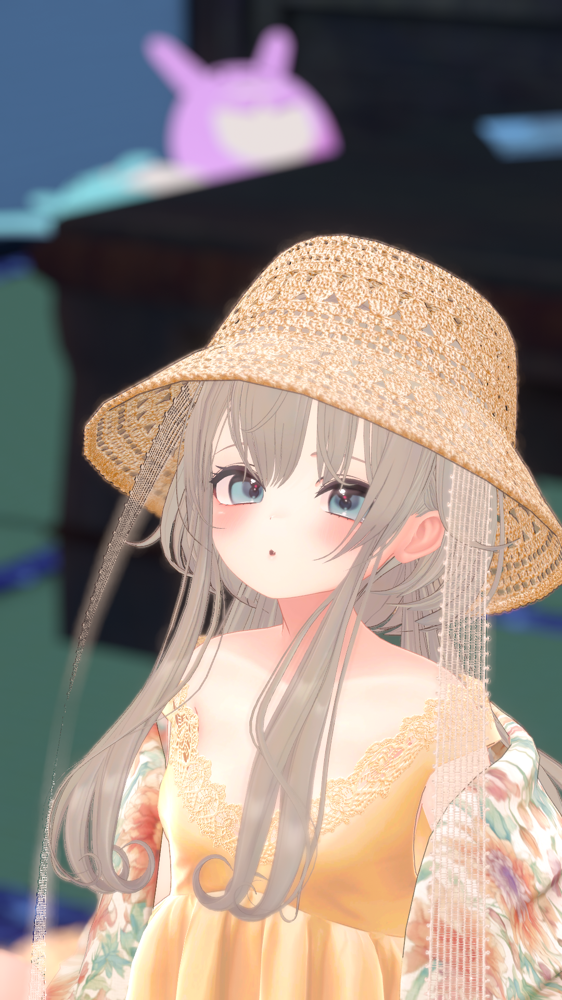

# 出入りできる絵画ギミックを作ろう (Dissolve / Stencil)
- **(ここで盛大に絵画ギミックで登場！！)**

---

<!-- _paginate: false -->

## 講師紹介
名前: ねこぼっくす
好きなもの: 紅茶と焼き菓子
最近ハマってること: Resonite

---

## アジェンダ
1. Dissolve / Stencil ってなに？
2. Dissolveでの消失エフェクトについて
3. Stencilでのマスク表現について
4. 組み合わせるとどうなる？
5. 絵画ギミックを実際に作ってみよう

---

<!-- header: '**1. Dissolve / Stencil ってなに？**' -->

# 1. Dissolve / Stencil ってなに？
2. Dissolveでの消失エフェクトについて
3. Stencilでのマスク表現について
4. 組み合わせるとどうなる？
5. 絵画ギミックを実際に作ってみよう

---

## Q. Dissolve / Stencil ってなに？
## A.「可視性に条件を設定するモノ」

---

## Dissolve(溶解) とは
- **条件を満たした部分を(溶かしたように)見えなくするモノ**
- 小物や衣装の「フェードイン/フェードアウト」によく使われる

---

## Stencil(型紙) とは
- **条件を満たした部分を(型紙のように)切り抜くモノ**
- いわゆる「マスク」を動的に行える

---

<!-- header: '**2. Dissolveでの消失エフェクトについて**' -->

1. Dissolve / Stencil ってなに？
# 2. Dissolveでの消失エフェクトについて
3. Stencilでのマスク表現について
4. 組み合わせるとどうなる？
5. 絵画ギミックを実際に作ってみよう

---

<!-- _paginate: false -->

## Dissolveってこんな感じ

---

## Dissolveの条件一覧
- **座標**: ルートボーンや原点からの距離もしくは方向で溶ける部分を指定
- **透明度**: テクスチャの透明度で溶ける部分を指定
- **UV**: テクスチャの中心からの距離もしくは方向で溶ける部分を指定

---

<!-- _paginate: false -->

の動作.gif)

### Dissolve(座標)の動作
ルートボーンや原点からの距離もしくは方向で溶ける部分を指定

---

<!-- _paginate: false -->

の動作.gif)

### Dissolve(透明度)の動作
テクスチャの透明度で溶ける部分を指定

---

<!-- _paginate: false -->

の動作.gif)

### Dissolve(UV)の動作
テクスチャの中心からの距離もしくは方向で溶ける部分を指定

---

## クイズ: Dissolve(座標)のルートボーンを動かすとどうなる？
みんなで考えてみよう！

---

## Q. Dissolve(座標)のルートボーンを動かすとどうなる？
## A. 溶け始める位置や方向を変えられる

---

<!-- _paginate: false -->

のルートボーンを動かした時の動作.gif)

### Dissolve(座標)のルートボーンを動かした時の動作
溶け始める位置や方向を変えられる

---

<!-- header: '**3. Stencilでのマスク表現について**' -->

1. Dissolve / Stencil ってなに？
2. Dissolveでの消失エフェクトについて
# 3. Stencilでのマスク表現について
4. 組み合わせるとどうなる？
5. 絵画ギミックを実際に作ってみよう

---

<!-- _paginate: false -->

## Stencilってこんな感じ

---

## Stencilの主な条件(Comp)一覧
- **Always**: Ref(値)を参照せず常に表示、liltoonのデフォルトはこれ
- **Equal**: 指定したRefと等しいオブジェクト越しに見たときだけ表示
- **NotEqual**: 指定したRefと等しいオブジェクト越しに見た時だけ非表示

---

## liltoonにおけるStencilのプリセット
- **Writer**: オブジェクトにRef(値)を設定する
- **Reader**: Writer越しに見たときにRefの値が同じなら非表示 (NotEqual)
- **Reader(反転)**: Writer越しに見たときにRefの値が同じなら表示 (Equal)

---

<!-- _paginate: false -->

の動作.gif)

### Readerの動作

Writer越しに見たときにRefの値が同じなら非表示 (NotEqual)

---

<!-- _paginate: false -->

の動作.gif)

### Reader(反転)の動作

Writer越しに見たときにRefの値が同じなら表示 (Equal)

---

## クイズ: ReaderとReader(反転)のマテリアルを同時に入れたらどうなる？
みんなで考えてみよう！

---

## Q. ReaderとReader(反転)のマテリアルを同時に入れたらどうなる？
## A. 共存して両方が個別の条件で表示される

---

<!-- _paginate: false -->

のマテリアルを同時に入れた時の動作.gif)

### ReaderとReader(反転)のマテリアルを同時に入れた時の動作

共存して両方が個別の条件で表示される

---

<!-- header: '**4. 組み合わせるとどうなる？**' -->

1. Dissolve / Stencil ってなに？
2. Dissolveでの消失エフェクトについて
3. Stencilでのマスク表現について
# 4. 組み合わせるとどうなる？
5. 絵画ギミックを実際に作ってみよう

---

## TODO: 作例紹介(実演も交える)、頑張ってギミック作る...！！！

---

<!-- header: '**5. 絵画ギミックを実際に作ってみよう**' -->

1. Dissolve / Stencil ってなに？
2. Dissolveでの消失エフェクトについて
3. Stencilでのマスク表現について
4. 組み合わせるとどうなる？
# 5. 絵画ギミックを実際に作ってみよう

---

## 絵画ギミックの作り方
- 額縁をStencil(Writer)兼Dissolve(座標)のルートボーンにする
- アバターのマテリアルをコピーしてRefの違うReaderとReader(反転)を作りアバターに付ける
- ReaderにDissolve(座標:線)で額縁の前側の時だけ表示するように(+Z)する
- Reader(反転)にDissolve(座標:線)で額縁の後ろ側の時だけ表示するように(-Z)する
- 額縁のON/OFFとワールド固定のメニューを作る

---

<!-- _paginate: false -->

兼Dissolve(座標)のルートボーンにする時の動作.gif)

### 額縁をStencil(Writer)兼Dissolve(座標)のルートボーンにする
- Stencil(Writer)は額縁越しに見たときにRefの値を変えるモノ
- Dissolve(座標)のルートボーン設定は額縁の位置を基準に溶けるようにするためのモノ

---

<!-- _paginate: false -->

を作りアバターに付ける.gif)

### アバターのマテリアルをコピーしてRefの違うReaderとReader(反転)を作りアバターに付ける
- Reader(反転)は額縁の内側でだけ見えるマテリアル、絵画ギミックの根幹
- Readerは本来Alwaysでも絵画ギミックは成立するのだが、機能は変わらずに応用で大活躍してくれるのでReaderで作る

---

<!-- _paginate: false -->

で額縁の前側の時だけ表示するように(+Z)する.gif)

### ReaderにDissolve(座標:線)で額縁の前側の時だけ表示するように(+Z)する

- Readerが額縁の外側でだけ見えるように額の内側をDissolveで消す
- Dissolveは描画モードがカットアウトか半透明でしか使えないので描画モードを変える

---

<!-- _paginate: false -->

にDissolve(座標:線)で額縁の後ろ側の時だけ表示するように(-Z)する.gif)

### Reader(反転)にDissolve(座標:線)で額縁の後ろ側の時だけ表示するように(-Z)する
- Reader(反転)が額縁の内側でだけ見えるように額の外側をDissolveで消す
- Dissolveは描画モードがカットアウトか半透明でしか使えないので描画モードを変える

---

<!-- _paginate: false -->

### 額縁のON/OFFとワールド固定のメニューを作る
- MA Object Toggleで額縁のON/OFF
- 額縁事態にMA World FixedをつけてMA Object ToggleとParent Constraintでワールド固定

---

<!-- _paginate: false -->

.gif)

### 動作確認(GestureManager)
アバターや額縁を動かしたり、メニューからON/OFFやワールド固定を試してみよう
全部が正常に動いたら...

---

## 絵画ギミック完成！おめでとう！！！

---

<!-- header: '' -->

## 振り返り
- Dissolve / Stencil は「可視性に条件を設定するモノ」
- Dissolve は「条件を満たした部分を(溶かしたように)見えなくするモノ」
- Stencil は「条件を満たした部分を(型紙のように)切り抜くモノ」

---

## 参考資料
- [Example](https://example.com)

---

## ご清聴ありがとうございました
